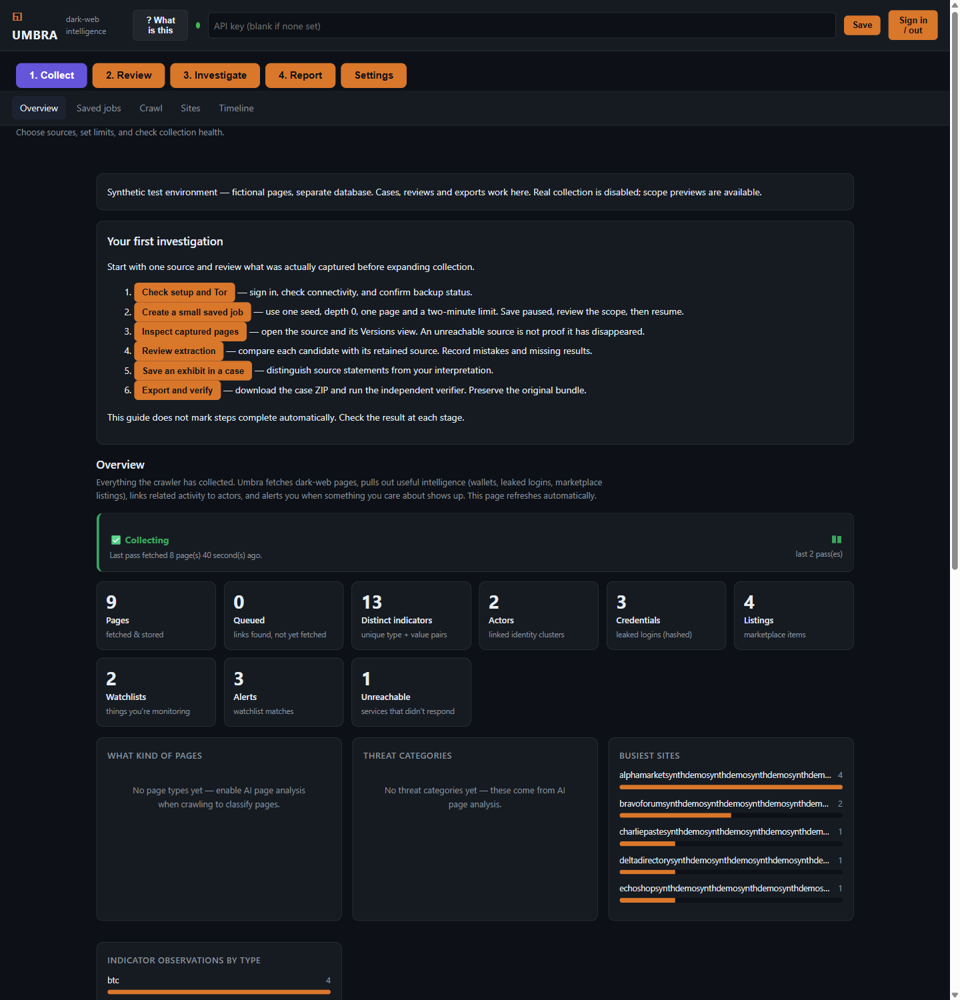
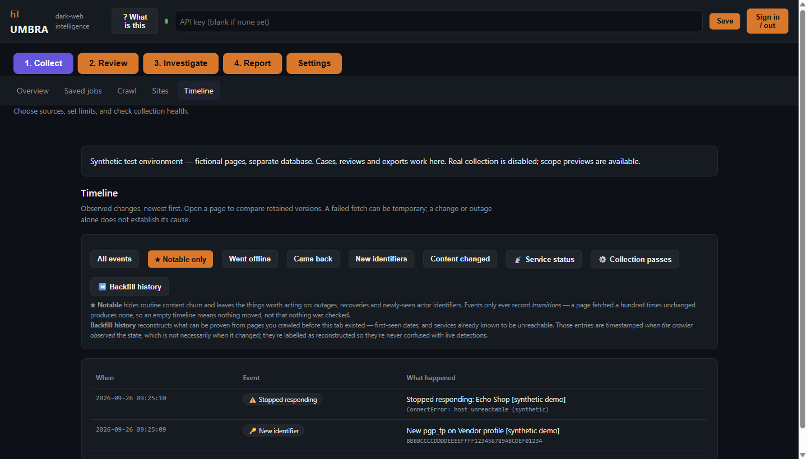
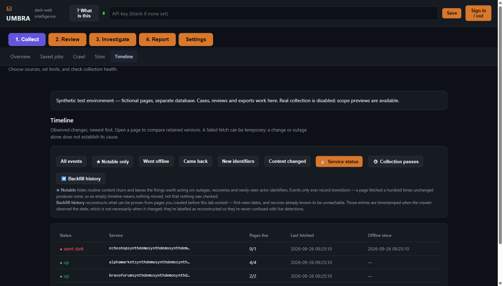
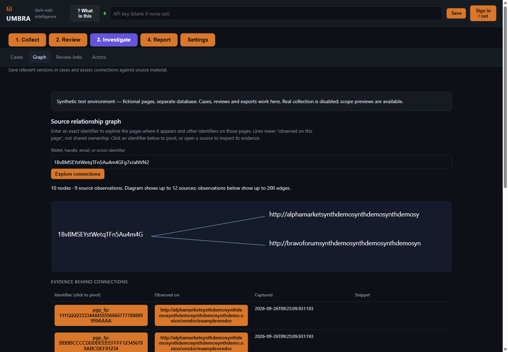
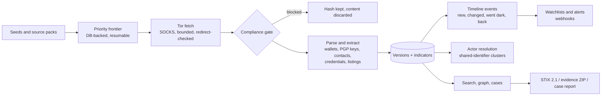

# Umbra

**A dark-web collection and intelligence platform:** an asynchronous Tor crawler,
indicator and identity extraction, a change-and-outage timeline, and an
investigator workspace with independently verifiable evidence export.



Umbra began as my final-year university project, a threaded "AI dark web
crawler" that received a First. This repository is a ground-up rebuild into a
production-shaped system: about 9,600 lines of Python, 200 tests running in CI
against both SQLite and PostgreSQL, and no paid API required anywhere.

---

## Try it in two minutes: no Tor, no network

```bash
git clone https://github.com/samrigby64/umbra.git && cd umbra
python -m venv .venv
.venv/bin/pip install -e ".[api,dev]"      # Windows: .venv\Scripts\pip ...
python scripts/demo_lab.py                  # then open http://127.0.0.1:8767/
```

The demo lab runs the **real** pipeline (crawler, extractors, timeline, run
health, actor resolution and watchlists) over a fictional site graph served
from memory. It records two collection passes. Between them, one shop goes dark
and a vendor rotates their PGP key, so the timeline and alerts have genuine
transitions to show. Every host, handle, key and address in it is fictional,
and live collection is disabled in that instance.

| Timeline: what changed | Service status: who went dark |
|---|---|
|  |  |



---

## What it does



The interface follows an investigator's workflow:

| Stage | What you can do |
|---|---|
| **Collect** | Saved, scheduled collection jobs with page and time budgets; strict host scope enforced on every redirect; source packs of curated targets; a health banner that reports when collection has **stopped**, not just what it has stored. |
| **Review** | Retained page versions with text diffs; exact-duplicate and mirror grouping; a collection-quality view; recording extraction mistakes against a specific version, reusable as regression examples. |
| **Investigate** | Full-text and semantic search; an identifier-to-source graph backed by snippets; actor clusters built from reused wallets, PGP fingerprints and published contacts; analyst confirm/reject decisions that survive graph rebuilds. |
| **Report** | Cases with exhibits and notes; printable case reports with redaction; STIX 2.1 export for MISP/OpenCTI; evidence ZIPs checked by a **standalone, standard-library-only verifier**. |

Accounts have administrator, analyst and viewer roles, optional TOTP multi-factor
authentication, and a hash-linked audit log. Backups are encrypted with AES-256-GCM.

---

## Engineering highlights

- **Crash-safe, resumable collection.** The frontier lives in the database.
  Claims use leases with heartbeats and integer claim tokens (SQLite datetimes
  don't round-trip exactly, which once silently discarded every completion).
  PostgreSQL uses advisory locks. A killed worker's pages and runs are reclaimed
  cleanly.
- **A compliance gate at ingest, not afterwards.** Media is never stored,
  operator blocklists discard matched content, pages matching a known-bad hash
  set are dropped without their content ever being stored, and leaked
  credentials are kept only as SHA-256 hashes.
- **Identity signals chosen for durability.** PGP fingerprints are computed
  from armoured key blocks (RFC 4880 v4), because vendors keep their keys
  across markets and rebrands. A fingerprint printed as `0x` + 40 hex (the
  keyserver notation) is recognised as the key it is, not recorded as an
  Ethereum wallet. Breach-victim email
  addresses never link actors; published operator contact addresses do.
- **Exports built for other people's tools.** STIX 2.1 object IDs are UUIDv5,
  so a re-export updates a threat-intel platform instead of duplicating into
  it. Evidence bundles state plainly what they do and don't establish.
- **Hostile input treated as hostile.** Webhook and non-Tor fetch targets are
  checked against private, loopback and link-local ranges on every redirect.
  A network-bound API never starts unauthenticated. Page text sent to an LLM
  is framed as untrusted, and the model's output can't create identifiers that
  link actors.
- **Health you can trust.** Every collection pass records how much work was
  waiting when it started, which separates *idle* (nothing to do) from
  *stalled* (work waiting, nothing fetched), and flags *stale* when no pass has
  completed recently.

## Bugs found by running it

None of these were caught by the test suite or by reading the code at the
time. Each was found by operating the system, and each now has a regression test.

- **The worker silently stopped collecting after its first pass.** Per-run
  counters were never reset, so the page budget became a lifetime cap. The
  logs kept reporting the first pass's totals, so everything *looked* healthy.
  This is why run health exists.
- **The health banner said "Collecting" with the worker dead for 26 hours.**
  The verdict came only from the last *completed* pass. Hence the `stale` verdict.
- **One malformed link aborted a whole page, and then the page looped forever.**
  Python 3.12 raises on `http://[dot]/`. Worse, the exception path never closed
  the claim, so the page was reclaimed and failed every five minutes, indefinitely.
- **Outages never appeared in the service view.** A failed recrawl keeps its
  page `crawled` so its archived content survives, and the view counted status
  alone. The synthetic demo found this, because there the right answer is known.
- **The demo database was lost to routine temp-directory cleanup.** The default
  database now lives in a per-user data directory.

## Measured results

These are small-corpus numbers from one machine over a few weeks, reported with
the caveats they need:

- **Curated source packs vs. seeding from a directory wiki:** unreachable
  fetches fell from 26% to 8%. Pages carrying no usable signal fell from 76.5% to 55%.
- **Keeping the crawl on its targets ("pinning"):** the share of fetches spent
  on target hosts rose from 24% to 94%, but signal density barely moved (64% →
  57% of pages with no signal). The hypothesis came from a 20-page sample that
  didn't hold at 568 pages. Most pages *inside* a marketplace are navigation.
- **Extraction:** on a 14-example synthetic benchmark, listing precision is
  66.7% and recall 100%. That's a regression baseline, not a claim about live accuracy.

---

## Running it for real

Umbra needs a Tor SOCKS proxy on `127.0.0.1:9050`.

- **Windows:** put the Tor Expert Bundle under `%LOCALAPPDATA%\umbra-tor`, then
  run `.\run-local.ps1` (API, GUI and worker) and stop with `.\stop-local.ps1`.
  See [TESTING.md](TESTING.md) for a guided walkthrough.
- **Elsewhere:** `docker compose up -d --build` brings up Tor, PostgreSQL, the
  API and a worker. See [deploy/README.md](deploy/README.md). The compose path
  has not yet been exercised end to end, so treat the first run as a test.

Configuration is through `UMBRA_*` environment variables; see
[.env.example](.env.example). The only bundled source pack, `getting-started`,
lists official onion services of public organisations, each verified over Tor.
Point `UMBRA_SOURCE_PACKS_PATH` at your own packs for anything else.

```bash
umbra --help            # crawl, worker, serve, sources, timeline, runs, liveness, ...
pytest -q               # no Tor or API key needed
python src/umbra/verify_evidence.py case-evidence.zip   # standalone evidence check
```

## Responsible use

This is research and defensive-investigation software. Collecting from hidden
services, and storing what you collect, may be unlawful where you are.
**Get legal advice before pointing it at real targets.** The compliance gate
limits what is *stored*; it doesn't make collection lawful. Evidence exports
are not notarised or independently timestamped, and an HMAC signature is not a
legal chain of custody. The repository ships no targets beyond public
organisations' onion services, and all demo data is fictional.

## Status and limitations

A single-node system, not a hosted service. Case permissions protect case
workspaces, but the collected corpus is shared within an installation, so
separate customers need separate installations. Listing extraction is
heuristic. Docker deployment and large-scale live Tor load are unvalidated.
[CHANGELOG.md](CHANGELOG.md) records what each release changed and how it was
checked.

## Licence

[MIT](LICENSE).
